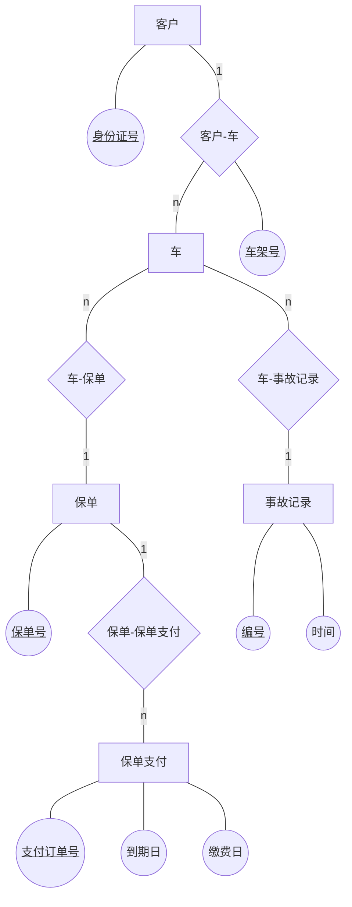

# 6.2 E-R图设计及其到关系模式的转换

关系模式表示方式：

关系名称（<u>关键字</u>，属性1，属性2，...）

## 6.2.1 E-R 图

要求：

+ 实体（数据表）用矩形表示。
+ 实体间关系用菱形表示。
+ 实体和实体间关系使用无向边连接，多对多（n/m）、一对多（1/n）、多对一（n/1）写无向边上。
+ 属性用椭圆表示，与实体之间使用无向边连接，关键字（主码/主键）使用下划线标注。

示例：

## 6.2.2 E-R 图到关系模式的转换

原则：

+ 一个实体对应一个关系模式（也就是一张表）
+ 实体间关系的转换，若：

   + 一对一：随便附加到一边。
   + 一对多、多对一：附加到多的一边。
   + 多对多：使用独立的关系模式。

例如 [6.2.1 E-R 图](#621-e-r-图) 中的 E-R 图转换为关系模式如下：

+ 客户（<u>身份证号</u>）
+ 车（<u>车架号</u>，身份证号，保单号）
+ 事故记录（<u>编号</u>，时间，车架号）
+ 保单（<u>保单号</u>）
+ 保单支付（<u>支付订单号</u>，到期日，缴费日，保单号）
