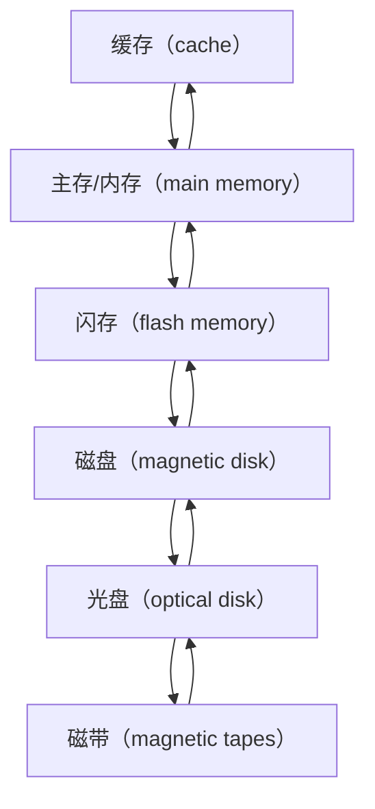

# 7.1 计算机系统的存储体系及工作原理

## 7.1.1 存储器层次

各层存储速度有数量级的差别。

慢介质以廉价和容量而未退出历史舞台。

存储分级：

1. primary storage：主存、高速缓存寄存器。
2. secondary storage：联机存储、闪存、磁盘。
3. tertiary storage：脱机存储、磁带、光盘。

易失和非易失存储器：

|           | 易失存储器 | 非易失存储器    |
|-----------|-------|-----------|
| 断电时是否丢失数据 | 是     | 否         |
| 类型        | 缓存、主存 | 二级、三级存储器  |

## 7.1.2 磁盘存储

机械硬盘的结构：

+ 移动部件：一个或多个盘片、每个盘面一个磁头
+ 物理存储空间：磁盘、盘片、盘面、磁、柱面、扇区。
+ 块：磁盘与主存之间传输数据的逻辑单元，由一个或扇区组成。

**平均故障时间（MTTF）**：预期系统无故障连续运行的平均旪间.

## 7.1.3 磁盘阵列

**磁盘阵列（RAID）**：Redundant Arrays of Inexpensive Disks，多盘联合、统一对外、高速、高容量、高可靠性。

常见 RAID 方案（假设使用同一款硬盘组 RAID）：

|        | 特点                | 容量              | 读速度             | 写速度       | 冗余性              |
|--------|-------------------|-----------------|-----------------|-----------|------------------|
| RAID 0 | 将数据平分的写入多个磁盘      | 所有磁盘容量叠加        | 所有磁盘读速度叠加       | 所有磁盘写速度叠加 | 无冗余，一块盘损坏则整个数据丢失 |
| RAID 1 | 将数据镜像的写入多个磁盘      | 等于单块硬盘          | 所有磁盘读速度叠加       | 等于单块硬盘    | 可损坏任意数量的磁盘不丢数据   |
| RAID 5 | 将数据和奇偶校验交叉的写入多个磁盘 | 使用 1 块盘用于存储奇偶校验 | $n - 1$ 块盘读速度叠加 | 低于单块硬盘    | 可损坏一块硬盘          |
